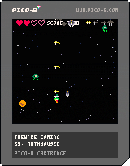

# theyre-coming-p8
 A space shooter written with the PICO-8 fantasy console.

 

## Approach and features

After messing around with PICO-8 with my kids, I thought I'd take a crack at something. I started following this tutorial series [Lazy Devs Academy - Shmup Playlist](https://www.youtube.com/playlist?list=PLea8cjCua_P3Sfq4XJqNVbd1vsWnh7LZd)...then realized only 12 episodes had been published (I caught up and episode 12 was published literally 1 hour before I started it). At that point I'd included:

- Moving starfield background
- Player ship that moves in two dimensions
- Player shooting
- A basic enemy (I created a meteor as well)
- Collision detection for player and enemies
- Sprites for player ship, enemies, etc.
- Animations for cannon flare, enemy explosions
- SFX for shooting, explosions
- Basic game states

I'd gone through those 12 in a few days and didn't want to wait for the next video to release, so I added a few things like:

- Enemy collisions with player bullets, explosion animation
- Multiple enemy types with varied spawning and movements
- Logic for the meteor so that it isn't destroyed by the basic weapon
- Weapon cooldown (and support for multiple weapon types in this)
- Leveling and increasing challenge
- Ability to start and restart games
- Slightly more advanced collision detection (to accommodate larger sprites or different hit box sizes) (Krystian refactored his code in a later episode)
- A simple high score (lost when reset)

## Ideas/further exploration

I don't plan on making this a super polished game, but I would like to continue with the tutorial (even though I have strayed from the path). Partially because Krystian is fun to watch and I love his silly but dilligent approach. I also like the idea of having a few enhancements to poke around at if the mood strikes me. As of now this includes:

- ~~Multiple canon types for the primary weapon~~ (complete)
- A secondary weapon (limited quantity of bombs) (next step: non-pew pew ideas)
- ~~Power-ups that appear in the starfield (have draw/update logic, need spawning plan)~~
- Better sprites for power ups
- ~~Short period of invincibility that follows the player getting hit~~ (complete)
- ~~High score that's not lost with a basic restart~~ (complete)
- ~~Music~~
- Gameplay/level music
- More enemy types (practice drawing sprites as well as more advanced movement patterns)
- Combining movement patterns and level design
- Final boss
- More elegant collision detection
- Cooler start screen
- More interesting enemy patterns

## New to PICO-8?

I am too. PICO-8 is a virtual computer purpose-built for developing games, which embraces strict limitations of the visuals (16 colors, 128x128 pixel screen, minimal player inputs, etc.). I like that it's a super lightweight IDE where I can do everything from game logic, to images, to sound all within the same basic editor.

PICO-8 implements a subset of the Lua programming language (which has been very easy to learn). No bells and whistles of fancy game engines here...but the limited abstractions/voodoo have been a breath of fresh air.

I bought a copy to support the developer, but you can actually get started for free in a browser verion: https://www.pico-8-edu.com/

I like that for any game, including the many games available online, I can peek in at the code to see what's going on and consider some of the design decisions (what I like and what I may do differently if presented the same challenge). 

Learn more at https://www.lexaloffle.com/pico-8.php

## Thanks

Huge thanks to Krystian at Lazy Devs Academy. His Shmup (shoot-em-up) from the tutorial videos is available here in its various stages of completion. https://github.com/Krystman/lazydevs-pico8-basic-shmup
